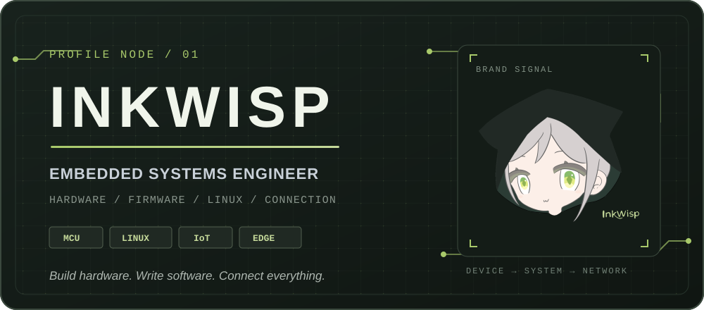

<p align="center">
  
</p>

## 01 — 从一块板，到一套系统

我是 **Inkwisp**。我关心的不只是让代码通过编译，而是让硬件、固件、操作系统和网络在真实设备上长期协同工作。

```text
SENSOR ──► MCU / RTOS ──► BUS / NETWORK ──► LINUX / EDGE ──► APPLICATION
```

从原理图与 PCB，到驱动、协议、上位机和边缘服务——我更喜欢把分散的技术拼成一条完整、可调试、可维护的工程链路。

> 让信号有路径，让设备有逻辑，让连接真正产生价值。

## 02 — 工程坐标

### `DEVICE` / 设备侧

围绕 MCU、板级外设与实时任务构建设备的基础能力。

`C` `C++` `STM32` `ESP32` `51 MCU` `ARM Cortex-M` `FreeRTOS`

### `SYSTEM` / 系统侧

在 Linux 环境中完成构建、部署、调试与设备管理，让软件稳定落在目标硬件上。

`Embedded Linux` `Linux` `Shell` `GCC` `CMake` `Git`

### `LINK` / 连接层

处理芯片之间、设备之间以及设备与云端之间的数据通路。

`UART` `SPI` `I2C` `CAN` `TCP/IP` `UDP` `MQTT` `Modbus` `Wi-Fi` `Bluetooth`

### `APPLICATION` / 应用层

为设备提供可操作、可观察的终端、上位机与工程工具。

`Qt` `Android` `Kotlin` `Python` `Vue`

## 03 — 工作台

```makefile
LANGUAGES := C C++ Python Kotlin Shell
TARGETS   := STM32 ESP32 ARM-Cortex-M Embedded-Linux Android
BUSES     := UART SPI I2C CAN
NETWORK   := TCP/IP UDP MQTT Modbus Wi-Fi Bluetooth
HARDWARE  := Schematic PCB Bring-up Debug

.PHONY: build connect iterate
build connect iterate:
	@echo "Make the whole system work."
```

我的工作方式通常从测量和定位开始：读数据手册、看波形、缩小问题边界，再逐层验证硬件、驱动、协议与应用。

## 04 — 项目索引

公开项目正在按“问题、方案、实现、结果”的方式重新整理。这里不会放虚构的项目、Star 数或演示链接。

[查看 Ink-Wisp 的全部公开仓库 →](https://github.com/Ink-Wisp?tab=repositories)

<!--
添加项目时复制以下结构：

### `P-01` / 项目名称

一句话说明项目解决的问题。

**链路：** Hardware → Firmware → Protocol → Application  
**技术：** `技术一` `技术二` `技术三`  
**仓库：** [查看项目](https://github.com/Ink-Wisp/REPOSITORY)
-->

## 05 — 保持连接

如果你也在构建设备、驱动、协议或边缘系统，可以从我的[个人主页](https://github.com/Ink-Wisp)继续了解。

<p align="center">
  <sub>INKWISP / HARDWARE × SOFTWARE × CONNECTION</sub><br>
  <strong>Keep the signal moving.</strong>
</p>
