<p align="center">
  <picture>
    <source media="(prefers-color-scheme: dark)" srcset="./assets/inkwisp-logo-dark.png">
    
  </picture>
</p>

<p align="center">
  <picture>
    <source media="(max-width: 600px)" srcset="./assets/inkwisp-celestial-header-mobile.svg">
    
  </picture>
</p>

<p align="center">
  <kbd>嵌入式系统</kbd>&nbsp;&nbsp;
  <kbd>Embedded Linux</kbd>&nbsp;&nbsp;
  <kbd>IoT</kbd>&nbsp;&nbsp;
  <kbd>边缘计算</kbd>
</p>

## 观测摘要

我是 **Inkwisp**，一名偏软硬件全链路的嵌入式开发者。

我喜欢从一块板开始，沿着信号向上追踪：画原理图、调外设、写驱动与协议，再连接 Linux、终端应用和边缘服务。比起孤立的功能，我更关心一整套系统能否稳定运行、清晰调试并持续演进。

```text
inkwisp@lab:~$ systemctl status signal-path
● signal-path.service
  路径：硬件 → 固件 → 协议 → Linux / Edge → 应用
  状态：持续构建中
```

## 系统轨道

<p align="center">
  <picture>
    <source media="(max-width: 600px)" srcset="./assets/inkwisp-system-orbit-mobile.svg">
    
  </picture>
</p>

## 工程工具箱

| 轨道 | 技术与工具 |
| :--- | :--- |
| **设备与实时系统** | `C` `C++` `STM32` `ESP32` `51 MCU` `ARM Cortex-M` `FreeRTOS` |
| **Linux 与构建** | `Embedded Linux` `Linux` `Shell` `GCC` `CMake` `Git` |
| **总线与协议** | `UART` `SPI` `I²C` `CAN` `TCP/IP` `UDP` `MQTT` `Modbus` `Wi-Fi` `Bluetooth` |
| **终端与应用** | `Qt` `Android` `Kotlin` `Python` `Vue` |
| **硬件开发** | `原理图设计` `PCB` `EasyEDA / 嘉立创EDA` `焊接与硬件调试` |

## 项目航线

公开项目正在按统一的工程档案格式整理。这里不展示虚构项目、无效链接或装饰性数据；可以先访问 [Ink-Wisp 的公开仓库](https://github.com/Ink-Wisp?tab=repositories)。

<!--
新增真实项目时，复制下面这一段并移出注释：

### 01 / 项目名称

一句话说明它解决了什么真实问题。

`硬件或平台` · `核心技术` · `协议或应用`

**工程链路：** Hardware → Firmware → Protocol → Application  
**仓库：** [查看项目](https://github.com/Ink-Wisp/REPOSITORY)
-->

<details>
<summary><strong>项目档案会记录什么</strong></summary>

每个项目将保留四项核心信息：它解决的问题、软硬件链路、关键技术和当前状态。这样以后增加项目时，只需复制同一个项目块，页面结构不会被破坏。

</details>

## 信号仍在继续

代码、实验记录和后续项目都以公开仓库中的实际内容为准。

<p align="center">
  <a href="https://github.com/Ink-Wisp">个人主页</a>
  &nbsp;&nbsp;·&nbsp;&nbsp;
  <a href="https://github.com/Ink-Wisp?tab=repositories">公开仓库</a>
</p>

<p align="center">
  <picture>
    <source media="(max-width: 600px)" srcset="./assets/inkwisp-celestial-footer-mobile.svg">
    
  </picture>
</p>
